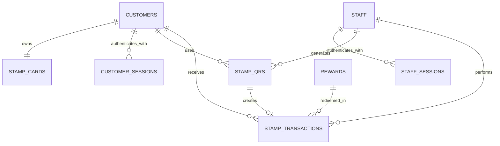

# Database design

The Digital Stamp Card MVP uses PostgreSQL UUID primary keys and stores only hashes of authentication and QR tokens.

## Relationships

## Tables

| Table | Purpose | Main relationships |
| --- | --- | --- |
| `customers` | Customer profile and unique phone number. | Owns one card and many sessions, QR uses, and transactions. |
| `staff` | Staff identity and password hash. | Owns many sessions, generated QR codes, and transactions. |
| `stamp_cards` | Current cached stamp balance. | Belongs to exactly one customer. |
| `rewards` | Available reward definitions and stamp cost. | Referenced by reward-redemption transactions. |
| `stamp_qrs` | One-time, expiring stamp claims. | Generated by staff and optionally used by one customer. |
| `stamp_transactions` | Immutable stamp and reward audit ledger. | Belongs to a customer and optionally references staff, a reward, or one QR. |
| `customer_sessions` | Hashed customer login sessions. | Belongs to one customer; deleted with that customer. |
| `staff_sessions` | Hashed staff login sessions. | Belongs to one staff member; deleted with that staff member. |

## Integrity rules

- A customer can have only one stamp card.
- A QR can create at most one stamp transaction.
- A used QR must identify when and by which customer it was used.
- Added stamps have a positive delta; reversals and redemptions have a negative delta.
- Reward redemptions must reference a reward.
- Session and QR plaintext tokens are never stored.
- Session expiry must be later than session creation.

`stamp_cards.stamp_count` is the fast current balance. `stamp_transactions` is the permanent audit history. Both must be changed in the same database transaction when stamps are added, reversed, or redeemed.
